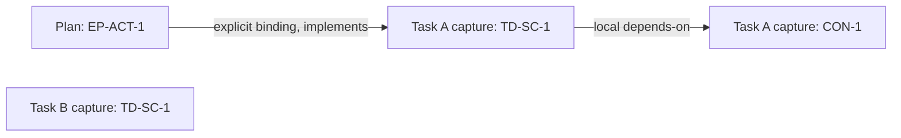

# Cross-document context for a plan action

## Document Control

| Field | Value |
| --- | --- |
| Title | Cross-document context for a plan action |
| Status | Draft |
| Revision | 2 |
| Brief owner | Markdown Trace maintainer |
| Reviewers | Codex design review and revision self-review; owner workflow acceptance pending |
| Decision owner | Jason Belmonti |
| Readiness statement | Ready for design discussion and contract refinement. Corpus behavior and workflow ergonomics still need proof before execution planning can rely on them. |
| Handoff summary | Keep the first delivery to explicit captures, occurrence-backed bindings, qualified queries and bounded selection; use existing per-document extraction in the consumer. |
| Last updated | 2026-09-26 |
| Source material | Owner-selected plan-action workflow; merged main at 0bce099df4bf30b017ea58490f6b32db62415d2a; sources in section 1 |
| Related docs | [Task 3](../tasks/delegation-context/03-cross-document-resolution.md), [current runtime](../current-implementation.md), [Task 4](../tasks/delegation-context/04-projection-policy-verification.md) |
| Related tickets | Task ID cross-document-trace-resolution; no external ticket required |

## 0. Human-Readable Summary

Decision requested: adopt an explicit in-memory corpus view as the first cross-document direction, with a small Node consumer for the plan-action workflow. Names and serialized schemas remain subject to detailed contract review.

Given a plan action, identify the exact task criteria and explicitly linked obligations it depends on, then retrieve their original text. The caller supplies the plan and task captures plus a small binding list. A binding connects an already observed reference occurrence to one exact target capture. Markdown Trace adds qualified lookup, incoming/outgoing references and bounded traversal over that view. The existing single-document graph and validation results remain intact.

This makes the delivered traversal and extraction useful across task/plan boundaries without requiring a new Markdown language, repository index or service. The first example uses one plan and two tasks that both declare `TD-SC-1`; it must select the intended task and reject revision substitution. The principal risk is authoring friction: declarations and bindings must be explicit, and a source edit invalidates occurrence pins.

Readiness and handoff: this is a first design, not an adopted specification, runtime result or verified worker packet. Mechanical obligation completeness and permission to replace full reads remain outside Task 3.

Section status: Complete.

## 1. Problem, Context, and Design Intent

A plan's `TD-SC-1` reference does not identify which task or source revision it means. Joining documents by bare ID would silently connect unrelated criteria. Today a caller must resolve those choices manually before retrieving text.

Current-state baseline: merged main `0bce099df4bf30b017ea58490f6b32db62415d2a` exports `traverseGraph` and `extractContext` from both package entrypoints. Analyses preserve source hashes, interpretation identity and exact occurrence ranges. Occurrence IDs are scoped to an analysis and may change after edits. Selections are issued handles for one analysis; arbitrary JSON or a corpus selection cannot be passed to `extractContext`.

Baseline checks in this preparation passed: build, 25 focused traversal/context tests, and a probe using the existing APIs. The probe located the plan's exact external-reference occurrence, observed its unresolved local traversal boundary, extracted selected task rows/constraints through genuine depth-zero local selections, and distinguished edited source under the same human revision label. It also confirmed that unannotated Task 3 has no declarations. These results establish reusable primitives, not corpus resolution or the proposed workflow's usability. Reproducible per-run inputs and results are retained locally under `.codefactory/task-3-design/` and excluded from repository publication.

| Source | Status | Use in brief | Gap if any |
| --- | --- | --- | --- |
| Owner request and workflow selection, 2026-09-26 | Available | Bounded design for plan action → task criteria and obligations | No particular live plan/task pair was supplied; use the existing task-authoring convention and a representative plan action first |
| Owner request to address design-review follow-ups, 2026-09-26 | Available; applied in revision 2 | Make local excerpt admission order explicit and exercise both plan and target-task edits | Local API probes establish mechanics; corpus runtime proof and owner acceptance remain outstanding |
| [Task 3 revision 2](../tasks/delegation-context/03-cross-document-resolution.md) | Available; reconciled in this change | Five completion criteria, current compatibility boundary and specification requirement | This brief does not discharge the adopted-specification criterion |
| [Direction revision 6](markdown-trace-document-graph-overview.md), [interfaces revision 10](markdown-trace-document-graph-interfaces.md) | Available; checksums verified | Document-local semantics, immutable capture, occurrence evidence, C-5/C-6/C-7/C-8 | Their traversal/context status descriptions lag implemented source; corpus remains an explicit extension |
| [Current implementation](../current-implementation.md), [authoring/API guide](../experimental-document-graph.md), source contracts, queries, traversal and context modules | Available at the baseline above | Actual reusable APIs and their limits | No corpus handle, qualified edge resolution or corpus traversal exists |
| [Opt-in TaskDefinition mapping](../../experiments/task-definition-trace/authoring.md) and its annotated task | Available as an example | Preserve visible criterion IDs while declaring graph entities in table cells | A plan annotation/binding example still needs workflow proof |
| [Task 4](../tasks/delegation-context/04-projection-policy-verification.md), current AGENTS.md | Available | Keep mandatory policy, full-read decisions and runtime activation separate; retain per-run evidence locally | No new authority to omit global obligations or launch workers |

Reconciliation: Tasks 1 and 2 are delivered prerequisites, not work to recreate. Task 3's obsolete legacy-consumer wording is removed; compatibility covers current graph APIs, profiles and the document command. Historical task validation records remain historical. The baseline also removes per-run planning artifacts from source Git; this design is a requested repository document, while probes and verbose validation stay ignored.

In scope: one finite corpus per call, exact source identity, explicit reference binding, qualified queries, bounded selection and a usable package consumer. Out of scope: automatic discovery, persistent indexing, a corpus context-budget engine, policy verification and installed workflow changes.

Section status: Complete.

## 2. Goals, Non-Goals, Constraints, and Assumptions

| ID | Objective | Success signal |
| --- | --- | --- |
| OBJ-1 | Follow a plan action to the intended task criterion and explicitly linked constraint | The first example returns the expected qualified nodes and exact explaining occurrences despite duplicate local IDs |
| OBJ-2 | Make missing or stale connections actionable | Every unresolved binding identifies its source occurrence and intended target; no substituted revision is accepted |
| OBJ-3 | Deliver a small consumer that can inspect and retrieve the selected source | A packed-package example runs outside the checkout, preserves inputs and emits per-source excerpts plus corpus path evidence |

| ID | Non-goal | Boundary reason |
| --- | --- | --- |
| NG-1 | New URI syntax, automatic repository/URL discovery, persistent stores or a global registry | Explicit supplied inputs cover the first workflow |
| NG-2 | Infer obligations from prose, guarantee mandatory completeness, verify worker packets or waive full reads | Task 4 and consuming workflow owners govern those claims |
| NG-3 | New stable CLI modes, capsule integration, fleet activation, package publication or model optimization | An experimental API and small caller-owned runner provide initial use |

| ID | Type | Statement | Source or basis | Owner or decision point | Design impact |
| --- | --- | --- | --- | --- | --- |
| CON-1 | Constraint | Preserve draft2, local graph facts, validation reports and current command behavior | Task 3 and repository direction | Maintainer, every interface decision | Corpus resolution is a separate view |
| CON-2 | Constraint | Bind to exact captures and observed occurrences; never infer the latest revision | Task 3 TD-SC-2/3 | Maintainer | Content hashes and analysis identities are authoritative; revision labels are descriptive |
| CON-3 | Constraint | Core accepts issued analyses and data only; host owns file reads | Existing common API rules | Maintainer | No second parser, hidden I/O or JSON handle hydration |
| ASM-1 | Assumption | A few explicitly annotated task/plan files and a short binding list are acceptable for the first use | Owner selected the plan-action workflow; existing opt-in annotation guide | Owner pilot, VAL-1 | Test setup and rebinding effort before claiming workflow readiness |
| Q-1 | Question | Does explicit pinning remain practical through both a plan edit and a target-task edit? | Local capture/pin trials in section 5; no corpus authoring trial or owner acceptance yet | Owner and maintainer, VAL-1 | Inspect all affected bindings and manual steps in both cases; if effort is unacceptable, revise the binding authoring surface before building a general resolver; do not add heuristic rebinding |

Section status: Complete.

## 3. Proposed System Shape

The selected direction is an immutable corpus view over the existing analyses. It qualifies their identities and resolves explicit bindings, then exposes queries over those facts. It does not concatenate documents or modify a local snapshot.

| ID | Decision | Rationale | Accepted tradeoff |
| --- | --- | --- | --- |
| DEC-1 | Use existing analysis identity plus local entity ID as the qualified entity key; retain document ID and source hash in exported references | Existing analysis identity already includes source, interpretation and runtime versions | Human revision labels and filenames alone cannot select a capture |
| DEC-2 | Supply bindings separately: pinned source analysis + reference occurrence → pinned target analysis + the same local target ID | Reuses draft2 occurrences and requires no language migration | Caller must inspect and pin occurrences; edits require explicit rebinding |
| DEC-3 | Initially bind only references whose local target is missing; reject attempts to redirect an already resolved or duplicate local target | Keeps ordinary local resolution unambiguous and avoids a precedence language | A document cannot use this first binding mechanism to override a same-named local definition |
| DEC-4 | Require one shared interpretation hash and matching graph/analyzer/parser versions across admitted captures | Task/plan vocabulary can share TD, EP, CON and existing pilot prefixes; no cross-profile translation is needed | Host reanalyzes sources with the shared vocabulary; document-specific validation policies may still differ |
| DEC-5 | Provide corpus lookup, direct references and bounded BFS; compose existing local extraction in the example consumer | Enough to locate the right obligations and retrieve their text now | Per-document budgets and bundles remain separate; no corpus-wide budget or completeness claim |

The binding does not author an edge independently: its source owner, relation kind, lexical target ID and source range come from the observed local relationship. It chooses only the exact external capture for that same target ID. Repeated references remain distinct occurrences. Multiple target choices for one occurrence remain unresolved, not first-match wins.

Rejected paths: global bare-ID joins lose document identity; new `ctx:` fields impose a language migration; concatenation changes ownership and source locations; repository scanning and persistent indexes solve discovery that this workflow does not need. Directly fabricating a local selection would violate existing issued-handle checks.

Stop or rework conditions: if useful examples require implicit bindings, redirection of resolved local references, heterogeneous interpretations or automatic source discovery, revisit the selected boundary explicitly. Do not grow those capabilities as hidden implementation details.

Section status: Complete.

## 4. Boundaries, Responsibilities, and Interfaces

| ID | Boundary or surface | Owner | Responsibility | Interface surface | Stability |
| --- | --- | --- | --- | --- | --- |
| SURF-1 | Source loading and workflow authoring | Host/example consumer | Supply explicit files, expected identities, annotations and bindings; show readable labels | Small local Node runner over the experimental package | Evolving |
| SURF-2 | Document analysis and extraction | Existing runtime | Parse once, issue analyses, preserve ownership and source; issue local selections and context | Existing public APIs unchanged | Stable within current experimental behavior |
| SURF-3 | Corpus construction and resolution | New corpus domain | Validate capture pins and compatibility; qualify entities; retain resolved/unresolved edge evidence | Proposed corpus constructor and inspectable result | Evolving |
| SURF-4 | Corpus query and selection | Corpus domain | Lookup, reference pages, canonical bounded paths and visible limits | Proposed qualified lookup/incoming/outgoing/traversal operations | Evolving |
| SURF-5 | Mandatory context and independent verification | Task 4 / consuming owner | Decide required obligations and verify completeness or authority | Future policy boundary | Outside this delivery |

No new Engine-facing extraction path is needed. Corpus internals own indexes; callers see Trace DTOs and opaque issued handles. A reusable traversal helper is justified only if it preserves both local and corpus semantics without exposing either one's private state.

Interface materialization candidates: corpus admission limits and identity, binding descriptor, unresolved-reference result, qualified pagination and selection provenance. Final names, error codes and DTO shapes are not specified here. Both existing package entrypoints should retain their common export surface; the document command remains unchanged.

Section status: Complete.

## 5. Data, State, and Control Flow

The first example has task A, task B and a plan. Both tasks declare `TD-SC-1`; task A also declares `CON-1`. The plan declares `EP-ACT-1` and has a typed reference to `TD-SC-1`. Its binding pins that occurrence to task A. Task A's criterion has a local typed reference to `CON-1`.

Use the existing visible-link convention, for example `[TD-SC-1](ctx://trace/entity/TD-SC-1?role=definition)` in a criterion ID cell and `[EP-ACT-1](ctx://trace/entity/EP-ACT-1?role=definition)` in a plan action cell. A criterion-reference cell can contain `[TD-SC-1](ctx://trace/entity/TD-SC-1?rel=implements)`. These are illustrative fragments, not whole validated task/plan documents. Plain IDs and an unlinked global constraint cannot be treated as declared, required context.

A caller-facing capture alias is only a convenience. Its descriptor pins expected source and analysis identities and supplies an issued analysis. Different content under the same document ID and human revision label is a distinct capture. A repeated identical analysis may be deduplicated; one alias pointing to conflicting identities fails admission. Changed pins must never be refreshed silently from current inputs.

The first binding is conceptually: **the plan capture's observed `implements TD-SC-1` occurrence → the task A capture's `TD-SC-1`**. Task B is supplied deliberately as a collision test and is never a fallback target. Capture pins include the source identities; an occurrence number alone is insufficient. For an edit, the caller captures and reviews the changed source, identifies the intended occurrence again, and deliberately creates a new binding. The runtime never updates that intent itself.

The local capture trial distinguishes two edits, each applied independently to the original example. Its one external binding makes the affected count one in each case; larger examples must report the actual count rather than assume one.

| Edit case | Observed pin changes | Explicit authoring steps | Binding impact |
| --- | --- | --- | --- |
| Insert an earlier plan action, EP-ACT-0, before EP-ACT-1 | Plan source hash and analysis ID change; the original implements occurrence moves from O2 to O3; task A capture stays unchanged | Recapture the plan; inspect EP-ACT-1's exact implements occurrence; replace source pins and occurrence ID; check that the target capture stayed unchanged | Review every binding sourced from the old plan capture, even if an occurrence number happens to remain equal; one existing binding in this trial |
| Change task A's criterion text while retaining TD-SC-1 and human revision 1 | Task source hash and analysis ID change; the plan capture and occurrence stay unchanged | Recapture task A; inspect the same criterion's changed text and declaration; replace target pins on incoming bindings; check that source pins stayed unchanged | Review every binding targeting the old task capture; one incoming binding in this trial. Any bindings sourced from that edited task also need source-pin review |

These observations and four listed authoring operations per case come from existing local APIs and illustrative binding descriptors, not an implemented corpus resolver or measured owner interaction. They do not prove stale-binding rejection or acceptable workflow effort. VAL-1 must exercise the actual consumer and record the owner's assessment before Q-1 is resolved.

| ID | Trigger or input | State or data touched | Control path | Output or terminal state |
| --- | --- | --- | --- | --- |
| FLOW-1 | Explicit source/profile inputs | Existing analyses and optional local validation reports | Host reads files and analyzes each once; checks caller-trusted expected identities | Captured sources, or admission error with no usable corpus |
| FLOW-2 | Captures and explicit bindings | Qualified local edges and binding-resolution records | Resolve exact observed source occurrence and target capture; retain local facts separately | Corpus with resolved edges and inspectable unresolved records |
| FLOW-3 | Qualified EP-ACT-1 root, relation filters, node/depth bounds | Corpus adjacency and visited set | BFS over uniquely resolved endpoints; preserve one canonical predecessor occurrence per node | Plan action, task A criterion and linked CON-1; task B excluded; limits and uncertainty explicit |
| FLOW-4 | Selected nodes grouped by analysis | Genuine local selections and existing C-7 output | For each nonempty group, call local traversal with those IDs as depth-zero roots; inherit its lexical root order for extractContext admission under an explicit local budget | Per-source exact context and omissions, alongside original corpus path evidence; corpus BFS priority is not excerpt admission priority |

The consumer must preserve the corpus selection separately: local depth-zero selections do not encode cross-document predecessor paths. They are a supported way to use the existing projector, not a new corpus projection API. No global byte budget or mandatory-content pass is implied.

The initial consumer deliberately inherits local lexical admission order. For task A, CON-1 is considered before TD-SC-1 even though the criterion is nearer the plan action in corpus traversal. A local probe found that TD-SC-1 alone required 176 source bytes; with both entities selected and the same 176-byte budget, extraction included CON-1 and omitted TD-SC-1 with `byte-budget`. The consumer must show that criterion omission beside the excerpts. Returned parts remain in source order; that display order does not change admission priority. A caller can raise the explicit per-document budget to retrieve both. Criterion-first admission would require a separate consumer decision; it is not promised by this design.

Proposed ordering is input-order independent: normalize captures and roots by document ID, source hash, analysis ID and local ID, using a documented locale-independent comparison; order adjacency by qualified source occurrence, relation and target. Preserve local C-6 BFS, filtering and boundary meanings. Exact tie-breaks need contract examples before implementation.

All state is immutable and process-local. Corpus identity includes the normalized admitted captures, binding choices and corpus semantic version; changing a binding must invalidate a previous corpus selection even when source bytes are unchanged. JSON is inspection data, not an importable live handle.

Section status: Complete.

## 6. Failure, Operations, Security, and Evolution Posture

| Concern | Posture | Evidence or planned control | Gap or follow-up |
| --- | --- | --- | --- |
| Admission failure | Malformed/conflicting descriptors, stale expected captures, incompatible interpretation/runtime, non-issued handles and exceeded limits return no usable corpus | Finite caller limits on captures, bindings and aggregate admitted source bytes; VAL-2 | Final limit fields and error DTOs need materialization |
| Unresolved reference | Missing supplied target, missing/duplicate/unknown-kind target definition, conflicting bindings, wrong lexical target or unusable owner stay explicit and non-traversable | Keep source occurrence, expected target and reason; reject a nonexistent source occurrence as invalid binding input; no local fallback after an explicit binding fails | Fix inputs and rebuild; do not search, guess or overwrite a local result |
| Queries and bounds | Missing/ambiguous roots fail selection; direct queries remain diagnostic; unresolved incident edges and node/depth limits remain visible | Cycle/diamond and order-permutation cases; VAL-3 | Corpus admission limits bound total input; traversal budgets do not promise latency isolation |
| Observability and local validity | Show source pins, interpretation/runtime IDs, corpus identity, bound/unresolved counts, predecessor evidence and per-analysis coverage/diagnostics | Compare local snapshots and validation reports before and after; VAL-2/3 | A missing local target may still fail local validation even when separately bound in the corpus |
| Security and trust | Caller owns files and expected identities; excerpt content remains untrusted data; core performs no I/O | Reject fabricated handles; verify current capture pins; preserve unchanged sources | No remote execution, network trust layer or worker-read receipt is introduced |
| Evolution and compatibility | Additive experimental corpus surface; preserve current APIs, commands and retired-workflow exclusion | Packed consumer, current regression gates and documented example; VAL-4 | Version corpus semantics separately; future policy or authoring conveniences need their own evidence |

Section status: Complete.

## 7. System Design Principles Evaluation

| Principle | Rating | Evidence | Follow-up |
| --- | --- | --- | --- |
| Problem/design clarity | Pass | Owner-selected action-to-obligation example with an explicit duplicate-ID counterexample | Preserve OBJ-1 |
| Boundary quality | Pass | Host I/O, local facts, corpus resolution and later policy have separate owners | Preserve CON-1/3 |
| Modularity and information hiding | Pass | Corpus view uses existing captures; no parser or persistence abstraction | Materialize SURF-3/4 without broad local-runtime refactoring |
| Data/state/control-flow coherence | Risk | Capture and occurrence identity are available; corpus identity and ordering remain proposed | VAL-2/3 and exact DTO examples |
| Failure and recovery posture | Pass | Admission errors and unresolved reference data have distinct outcomes; rebuild after correction | Carry failure cases into the contract |
| Security/trust posture | Pass | Explicit local inputs, trusted expected pins, no implicit authority from context | Preserve NG-2 |
| Operational observability | Pass | Original occurrence evidence and separate local/corpus status stay visible | Prove diagnostic usefulness in VAL-1 |
| Validation adequacy | Risk | Existing APIs have baseline proof; proposed corpus behavior does not | VAL-1 through VAL-4 |
| Downstream execution readiness | Risk | Direction is bounded; binding ergonomics and final interfaces are not proven | Resolve Q-1 and materialize contracts before treating this as executable |

Section status: Complete.

## 8. Risks, Unknowns, and Validation Plan

| ID | Type | Statement | Impact | Owner or decision point | Mitigation or readiness impact |
| --- | --- | --- | --- | --- | --- |
| RISK-1 | Risk | Pinning occurrences and target captures may make normal edits cumbersome | Technically correct feature sees little workflow use | Owner and maintainer, first example | Exercise both edit cases from section 5 through the actual consumer; count affected bindings and manual steps, then obtain the owner's assessment to resolve Q-1 before execution reliance |
| RISK-2 | Risk | A resolved corpus edge is mistaken for local validity or complete context | Missing global obligations appear safe to omit | Maintainer, consumer presentation | Display separate status and omissions; include an unlinked global constraint in the example |
| RISK-3 | Risk | Heterogeneous profiles or hidden local-target overrides expand the first delivery | Translation and precedence machinery delay use | Maintainer, contract review | Keep DEC-3/4 explicit; reject unsupported combinations |
| RISK-4 | Risk | Tiny fixtures conceal unusable authoring or query cost | No real workflow improvement | Owner, bounded pilot | Retain the existing annotated task shape and a representative plan table; report input size, binding count and setup steps without a production-scale claim |

| ID | Validates | Evidence required | Readiness dependency |
| --- | --- | --- | --- |
| VAL-1 | OBJ-1/3 and Q-1: usable action-to-obligation workflow | Annotated plan, two tasks with colliding IDs, linked CON-1 and an unlinked global constraint; exact expected qualified paths; show the criterion's omission under an insufficient local budget. Independently insert an earlier plan action and edit target-task text under the same human revision label; record changed pins, all affected bindings and manual steps, reject stale bindings and deliberately rebuild. Record the owner's assessment of effort | Needed before workflow readiness; local budget and capture/pin trials passed, but actual corpus behavior and owner acceptance remain unproven |
| VAL-2 | Identity, explicit binding and preservation | Two captures under the same revision label; missing target, conflicting bindings/aliases, stale pins and incompatible interpretation; inspect original occurrence ranges and unchanged local validation | Required for the proposed contract and eventual runtime acceptance |
| VAL-3 | Deterministic bounded queries | Incoming/outgoing agreement, repeated occurrence evidence, cycle/diamond, node/depth limits, input permutations, binding-change selection invalidation | Required before relying on corpus selection |
| VAL-4 | Package and compatibility | Isolated packed consumer, current enforcement, documented explicit-input example, unchanged source/profile bytes and preserved local API/command results | Required before claiming a delivered usable capability |

Section status: Complete.

## 9. Readiness and Handoff

Readiness statement: the direction and first-use boundary are clear enough for owner discussion and further contract work. This brief is not sufficient authority for implementation or a substitute for Task 3's adopted-specification evidence. Rigor posture is R2: an additive experimental API with durable identity and provenance semantics needs detailed contracts, despite a small local deployment boundary.

Evidence gaps or blockers: corpus functions do not exist; binding ergonomics and exact interface/ordering/error contracts are unproven. Q-1 blocks claiming workflow readiness, not discussing this first draft. The smallest useful evidence is the three-document example with separate plan-edit and target-task-edit cases plus an insufficient local budget. Existing local probes establish pin changes and excerpt admission behavior; actual corpus rejection/rebuild and owner acceptance remain outstanding.

| Handoff item | Carry forward | Required evidence | Validation IDs |
| --- | --- | --- | --- |
| First-use scope | Action → intended criterion → explicitly linked constraint; unlinked material remains visible as outside the selection guarantee; local lexical excerpt admission may omit the criterion | Owner-readable omissions and separate plan-edit/target-task-edit steps, affected-binding counts and owner assessment | VAL-1 |
| Qualified identity and binding | Exact captured source, analysis-scoped occurrences, no implicit revision or local-target override | Positive/negative consumer cases and unchanged local verdicts | VAL-2 |
| Query semantics | One canonical shortest path, original occurrence provenance, separate bounds/uncertainty and corpus identity | Cycle, permutation and changed-binding examples | VAL-3 |
| Delivery boundary | Experimental package and small host consumer; genuine local issued selections for excerpts; no new global context policy | Real packed execution and existing compatibility observations | VAL-4 |

Traceability notes: Task 3 TD-SC-1 is the later adopted-contract gate; TD-SC-2/3 correspond to VAL-1/2, TD-SC-4 to VAL-3, and TD-SC-5 to VAL-4. All five criteria remain required. Per-document excerpt composition is a consumer demonstration of delivered C-7, not an added corpus projection subsystem. Read this brief and Task 3's complete controlling sources before using either for handoff. Per-run plans and verbose proof belong in ignored local storage.

Section status: Complete.

## Internal Review Record

| Field | Value |
| --- | --- |
| Mode | Author self-review |
| Readiness framing | System Design Brief; first draft for discussion and contract refinement, not execution approval |
| Structural completeness | All required sections and principle ratings present; section ledger 0–9 Complete |
| Principles rubric result | Six Pass, three Risk; no Fail; risks carried into VAL-1 through VAL-4 |
| Validation result | Revision 2 structural validation is recorded with its content hash in local evidence. The local follow-up probe passed the 176-byte omission case and both capture/pin edit cases. Earlier build and 25 focused tests remain baseline evidence; no corpus behavior is claimed |
| Findings addressed | Preserved corpus/local-selection separation and bounded compatibility; resolved REV-1 by specifying lexical excerpt admission and its omission example, and REV-2 by separating and probing both edit cases with explicit remaining workflow gates |
| Remaining findings | Q-1 and runtime/interface evidence remain bounded readiness gaps; no claim of a usable corpus implementation |
| Final verdict | Approve readiness with non-blocking follow-up for design discussion only; execution reliance remains unavailable |

| Finding ID | Severity | Status | Section or principle | Finding | Required action | Owner |
| --- | --- | --- | --- | --- | --- | --- |
| SDB-1 | Major | Resolved | 5 / control flow | A corpus selection cannot be accepted as an existing local GraphSelection | Use issued depth-zero local selections and retain corpus paths separately, as specified in FLOW-4 | Maintainer |
| SDB-2 | Major | Resolved | 3 / boundary quality | Cross-profile translation and local-target redirection would expand the first delivery | Explicitly constrain both in DEC-3/4 and preserve negative proof | Maintainer |
| SDB-3 | Observation | Open | 8 / workflow readiness | Real authoring and edit/rebind cost remains unmeasured | Complete VAL-1 before claiming workflow readiness | Owner and maintainer |
| REV-1 | Minor | Resolved | 5 / FLOW-4 | Local root sorting changes excerpt admission priority relative to corpus BFS | Inherit lexical order explicitly and show the proven criterion omission; carry the insufficient-budget case into VAL-1 | Maintainer |
| REV-2 | Minor | Resolved | 2 / Q-1 and 8 / VAL-1 | A single unspecified edit trial can hide source-pin or target-pin maintenance | Separate both cases, record local pin changes and affected-binding counts, and retain actual consumer proof and owner assessment as Q-1 gates | Owner and maintainer |

Revision 2 addresses the owner's design-review follow-ups without changing Task 3's completion criteria or the selected corpus scope. The revision 1 review and validation records remain historical; current structural evidence identifies revision 2 separately in ignored local storage.
